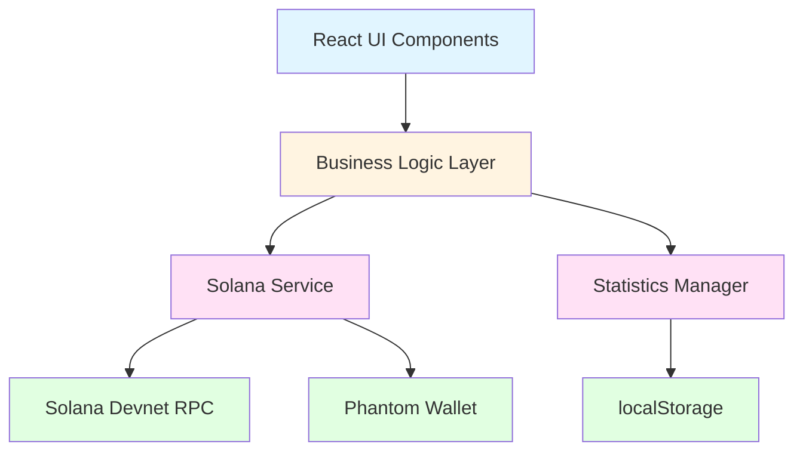
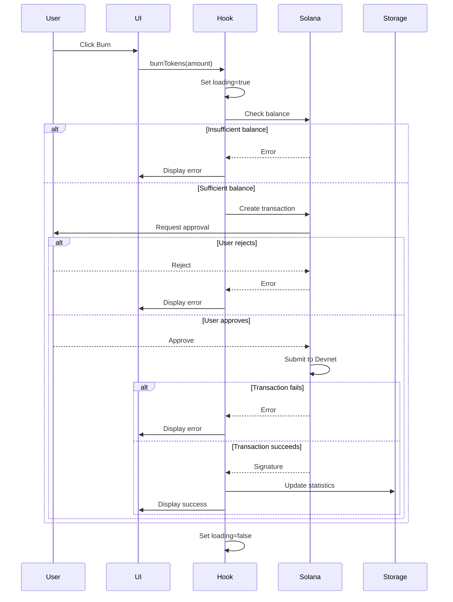

# Design Document: Solana Devnet Token Burning

## Overview

This design implements a Solana Devnet token burning system for hackathon demo purposes. The system allows users to connect their Phantom wallet, obtain test SPL tokens on Devnet, burn tokens by transferring them to the Solana incinerator address, and track their personal burn statistics using browser localStorage.

The architecture follows a component-based approach with clear separation between blockchain interaction, state management, and UI presentation. All operations occur on Solana Devnet to ensure safe testing without real cryptocurrency.

## Architecture

The system consists of four main layers:

1. **Blockchain Layer**: Handles all Solana Devnet interactions using @solana/web3.js and @solana/spl-token
2. **State Management Layer**: Manages application state and localStorage persistence
3. **Business Logic Layer**: Implements token burning, minting, and statistics tracking
4. **Presentation Layer**: React components for user interface and feedback



## Components and Interfaces

### 1. Solana Service

Handles all blockchain interactions with Solana Devnet.

```typescript
interface SolanaService {
  // Initialize connection to Devnet
  connection: Connection;
  
  // Connect to Phantom wallet
  connectWallet(): Promise<PublicKey>;
  
  // Get user's token balance
  getTokenBalance(walletAddress: PublicKey, tokenMint: PublicKey): Promise<number>;
  
  // Burn tokens by sending to incinerator
  burnTokens(
    amount: number,
    tokenMint: PublicKey,
    walletAddress: PublicKey
  ): Promise<string>; // Returns transaction signature
  
  // Mint test tokens to user's wallet
  mintTestTokens(
    walletAddress: PublicKey,
    amount: number
  ): Promise<string>; // Returns transaction signature
}

// Constants
const DEVNET_RPC_ENDPOINT = "https://api.devnet.solana.com";
const BURN_ADDRESS = "1nc1nerator11111111111111111111111111111111";
const TEST_TOKEN_MINT = PublicKey; // Created or existing test token on Devnet
```

**Implementation Details:**
- Use `Connection` from @solana/web3.js configured with Devnet endpoint
- Use `getAssociatedTokenAddress` and `createTransferInstruction` from @solana/spl-token
- Handle Phantom wallet connection via `window.solana` provider
- All transactions require user approval through Phantom wallet
- Transaction confirmations use `confirmed` commitment level for faster feedback

### 2. Statistics Manager

Manages localStorage persistence for user burn statistics.

```typescript
interface UserStatistics {
  totalBurned: number;        // Total tokens burned across all time
  todayBurned: number;        // Tokens burned today
  totalClicks: number;        // Total number of burn transactions
  lastBurnTimestamp: number;  // Unix timestamp of last burn
  lastResetDate: string;      // Date string for daily reset (YYYY-MM-DD)
}

interface StatisticsManager {
  // Load statistics from localStorage
  loadStatistics(): UserStatistics;
  
  // Save statistics to localStorage
  saveStatistics(stats: UserStatistics): void;
  
  // Update statistics after a burn
  updateAfterBurn(burnAmount: number): UserStatistics;
  
  // Check if daily reset is needed
  checkDailyReset(): UserStatistics;
}

// localStorage key
const STORAGE_KEY = "solana_burn_statistics";
```

**Implementation Details:**
- Store statistics as JSON string in localStorage
- Check date on load to reset `todayBurned` if new day
- Use `Date.now()` for timestamps
- Use `new Date().toISOString().split('T')[0]` for date comparison
- Handle missing localStorage data with default zero values

### 3. Token Burning Hook

React hook that combines Solana service and statistics management.

```typescript
interface UseBurnTokensResult {
  // State
  isConnected: boolean;
  walletAddress: PublicKey | null;
  tokenBalance: number;
  statistics: UserStatistics;
  isLoading: boolean;
  error: string | null;
  
  // Actions
  connectWallet(): Promise<void>;
  burnTokens(amount: number): Promise<void>;
  getTestTokens(): Promise<void>;
  clearError(): void;
}

function useBurnTokens(): UseBurnTokensResult;
```

**Implementation Details:**
- Use React hooks (useState, useEffect, useCallback)
- Load statistics on mount and after wallet connection
- Refresh token balance after minting or burning
- Set loading states during async operations
- Catch and format errors for user display
- Automatically check for daily reset on mount

### 4. UI Components

React components for user interface.

```typescript
// Main component
interface BurnInterfaceProps {
  // No props needed - uses hook internally
}

function BurnInterface(): JSX.Element;

// Sub-components
function WalletConnection(): JSX.Element;
function TokenBalance(): JSX.Element;
function BurnButton(): JSX.Element;
function TestTokenButton(): JSX.Element;
function UserStatistics(): JSX.Element;
function GlobalStatistics(): JSX.Element; // Mock data with "DEMO DATA" label
function LoadingSpinner(): JSX.Element;
function ErrorMessage(): JSX.Element;
```

**Implementation Details:**
- Disable buttons during loading states
- Show loading spinner during transactions
- Display error messages with clear dismiss action
- Format numbers with appropriate decimal places
- Format timestamps as human-readable dates
- Use visual distinction for demo data label

## Data Models

### User Statistics Model

```typescript
interface UserStatistics {
  totalBurned: number;        // Cumulative total, never resets
  todayBurned: number;        // Resets at midnight local time
  totalClicks: number;        // Increments with each burn transaction
  lastBurnTimestamp: number;  // Unix timestamp in milliseconds
  lastResetDate: string;      // ISO date string (YYYY-MM-DD)
}

// Default values
const DEFAULT_STATISTICS: UserStatistics = {
  totalBurned: 0,
  todayBurned: 0,
  totalClicks: 0,
  lastBurnTimestamp: 0,
  lastResetDate: new Date().toISOString().split('T')[0]
};
```

### Transaction Result Model

```typescript
interface TransactionResult {
  success: boolean;
  signature?: string;      // Solana transaction signature
  error?: string;          // Error message if failed
}
```

### Wallet State Model

```typescript
interface WalletState {
  connected: boolean;
  publicKey: PublicKey | null;
  balance: number;         // Token balance
}
```

## Error Handling

### Error Categories

1. **Wallet Errors**
   - Wallet not installed: "Please install Phantom wallet"
   - Connection rejected: "Wallet connection rejected"
   - Wallet locked: "Please unlock your Phantom wallet"

2. **Transaction Errors**
   - Insufficient balance: "Insufficient token balance. Get test tokens first."
   - Transaction rejected: "Transaction rejected by wallet"
   - Network error: "Network error, please try again"
   - Transaction timeout: "Transaction timed out, please try again"

3. **Token Errors**
   - Token account not found: "Token account not found. Get test tokens first."
   - Invalid token mint: "Invalid token configuration"

4. **Storage Errors**
   - localStorage unavailable: Log warning, continue with in-memory state
   - Parse error: Reset to default statistics

### Error Handling Strategy

```typescript
function handleError(error: unknown): string {
  if (error instanceof Error) {
    // Check for specific Solana errors
    if (error.message.includes("User rejected")) {
      return "Transaction rejected by wallet";
    }
    if (error.message.includes("Insufficient funds")) {
      return "Insufficient token balance. Get test tokens first.";
    }
    if (error.message.includes("TokenAccountNotFound")) {
      return "Token account not found. Get test tokens first.";
    }
    // Generic error
    return error.message;
  }
  return "An unexpected error occurred";
}
```

### Transaction Flow with Error Handling



## Testing Strategy

The testing strategy combines unit tests for specific functionality and property-based tests for universal correctness properties. Both approaches are complementary and necessary for comprehensive coverage.

### Unit Testing

Unit tests will verify:
- Specific examples of statistics calculations
- Error message formatting for known error types
- localStorage serialization/deserialization
- Date comparison logic for daily resets
- Component rendering with specific props
- Button state changes during loading

### Property-Based Testing

Property-based tests will verify universal properties across many generated inputs. Each test will run a minimum of 100 iterations with randomized inputs.

The property-based testing library for TypeScript will be **fast-check**.

Each property test will include a comment tag in the format:
```typescript
// Feature: solana-devnet-integration, Property N: [property description]
```

Properties will be defined in the Correctness Properties section below.


## Correctness Properties

A property is a characteristic or behavior that should hold true across all valid executions of a system—essentially, a formal statement about what the system should do. Properties serve as the bridge between human-readable specifications and machine-verifiable correctness guarantees.

### Property 1: Statistics localStorage Round-Trip

*For any* valid UserStatistics object, saving it to localStorage and then loading it back should produce an equivalent object with all fields preserved (totalBurned, todayBurned, totalClicks, lastBurnTimestamp, lastResetDate).

**Validates: Requirements 4.1, 4.2, 4.4, 4.5, 4.7**

### Property 2: Statistics Update After Burn

*For any* burn amount greater than zero, when a burn transaction completes successfully, the statistics should be updated such that:
- totalBurned increases by the burn amount
- todayBurned increases by the burn amount
- totalClicks increases by 1
- lastBurnTimestamp is set to the current time
- The updated statistics are immediately persisted to localStorage

**Validates: Requirements 3.4, 4.6**

### Property 3: Daily Reset Logic

*For any* UserStatistics object where the lastResetDate is before today's date, checking for daily reset should produce a new statistics object where:
- todayBurned is reset to 0
- lastResetDate is updated to today's date
- All other fields (totalBurned, totalClicks, lastBurnTimestamp) remain unchanged

**Validates: Requirements 4.3**

### Property 4: UI Reactivity to Statistics

*For any* two different UserStatistics objects, when the statistics state changes from one to the other, the UI should immediately reflect all changed values without requiring a page refresh.

**Validates: Requirements 5.5**

### Property 5: Error State Clearing

*For any* error state (error message is non-null), when a new transaction is initiated, the error state should be cleared (set to null) before the transaction begins.

**Validates: Requirements 7.5**

### Property 6: Button State During Transactions

*For any* transaction operation (burn or mint), the following button state invariant should hold:
- WHILE isLoading is true, all action buttons should be disabled
- WHEN isLoading transitions to false, all action buttons should be enabled
- This should hold regardless of whether the transaction succeeded or failed

**Validates: Requirements 8.4, 8.5**
